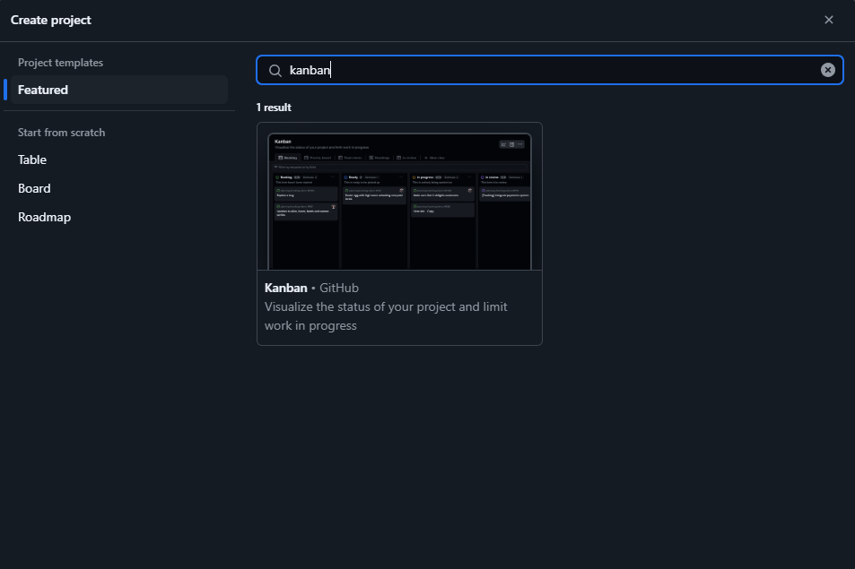

# **Actividad 17: Gestión ágil de proyectos con GitHub Projects, configuración de Kanban Board y creación de historias de usuario**

### Objetivos:

* Configurar y personalizar un Kanban board en GitHub Projects para gestionar el flujo de trabajo de manera eficiente.
* Crear y utilizar plantillas de issues en GitHub para estandarizar la escritura de historias de usuario.
* Organizar y priorizar el product backlog mediante la creación, edición y reordenación de historias de usuario en el Kanban board.
* Realizar el refinamiento del backlog, preparando las historias para el sprint y asegurando la correcta asignación de etiquetas y categorías.
* Utilizar GitHub Projects como una herramienta efectiva para la planificación, seguimiento y entrega de proyectos ágiles.

### Parte 1:

Primeramente navegamos en el repositorio de trabajo, y realizmos clic en la pestaña **Projects**, ya en esta pestaña seleccionamos **New Porject**. Al realizar clic, se abrira la siguiente ventana:

<div align = "center">
    
</div>

En esta ventana, seleccionamos *Kanban* y posteriormente renombramos el project a **Devops-agile**. Ya en el project Kanban creamos o renombramos las columnas como se muestra: 

<div align = "center">
    
</div>

### Parte 2

En el repositorio de trabajo, seleccionamos **Settings**. Al ser seleccionada, nos desplazamos hacia abajo y encontraremos la seccion **Features** y seleccionamos **Set up templates**

<div align = "center">
    
</div>

Selecionamos **Custom template** y se nos abrira una nueva pestaña para crear nuestra plantilla como se muestra en la siguiente imagen:

<div align = "center">
    
</div>

Aqui cambiamos el nombre a **User Story**, darle una descripcion apropiada y pegar lo siguiente en **Template content**:

```
**As a** (specific role – e.g., "developer," "admin," "customer")  
**I need** (clear functionality or feature needed)  
**So that** (explain the value or business reason for this feature)

---

## *Context & Assumptions*
- List any known constraints, assumptions, or dependencies.  
- Mention related user stories or issues (if applicable).

---

## *Acceptance criteria*
```gherkin
Scenario: <Short Description>  
Given <initial context or system state>  
When <user performs an action>  
Then <expected outcome or behavior>  
And <optional additional conditions>
```

Finalmente presionamos el boton **Propose changes** y presionamos el boton **Commit changes** para confirmar el cambio en el repositorio.

### Parte 3

En esta parte se crearan las siguientes 7 historias de usuario usando Github issues:

1. Need a service that has a counter
2. Must allow multiple counters
3. Must persist counter across restarts
4. Counter can be reset
5. Deploy service to the cloud
6. Need the ability to remove a counter
7. Need the ability to update a counter a new value

Asi que al tener la Issue template, vamos a la pestaña **Issues** del repositorio, damos clic en **New Issue**. Se vera el template que creamos y le daremos clic.

<div align = "center">
    
</div>

Al crear la issue, lo añadimos al project con el boton de a lado justo en la columna **New Issue**

<div align = "center">
    
</div>

Para no tener muchas issues en el project, se pone limite en la columna **New Issue** con la opcion **Set limit** con 7 issues.

<div align = "center">
    
</div>

Priorizamos el product backlog y modificamos nuestros items del Project como se muestra.

<div align = "center">
    
</div>

### Parte 4

En esta parte, uno de los integrantes del grupo sera el producto owner y preparara el producto backlog para la planificacion del sprint. Esto implica preparar y mejorar las hisotrias de usuario hechas anteriormente para hacerlas listas para el sprint.

Ademas se crea una nueva label en Github llamada `technical debt` para marcar aquellas hisotrias de usuario que no aportan valor al cliente, pero es necesario para el desarrollo y lo añadimos a las issues que lo necesitan. Debiendonos quedar asi el Project:

<div align = "center">
  
</div>


## **Ejercicio 3: Automatización de Kanban board con GitHub Actions**

Automatizar un Kanban board con GitHub Actions implica usar flujos de trabajo que reaccionen a eventos como pull requests, issues, o commits, y que actualicen automáticamente el estado de una tarjeta en un GitHub Project. 

### **Automatizaciones:**

#### **1. Mover una issue a "In progress" cuando se realize una PR**

El flujo solo automatiza la acción de mover a "In progress". Es necesario usar "Closes #X o Fixed #x" en el cuerpo de la PR **principal** para que el flujo detecte para qué historia se abre o reabre la PR y luego esta historio se mueva a "In progress".

En esta automatización se utilizo la herramienta `Github CLI`, que maneja Github a traves de una terminal. Ademas necesitamos generar Personal Access Token (PAT) con scopes `repo`, `workflow`, `admin`, `packages`, `project`; y lo guardarla en `Settings` → `Secrets` → `CI_TOKEN`.

Asi que primeramente realizamos la accion que desencadena cuando una PR es abierta o reabierta para su revisión:

``` yml
name: Mover una issue a "In progress" cuando se realize una PR

on:
    pull_request:
        types: [opened, reopened]
```

Luego se define el nombre del job (move-card) y el sistema operativo sobre el cual se ejecutará. En este caso, se usará una máquina virtual con Ubuntu 22.04.

``` yml
jobs:
    move-card:
        runs-on: ubuntu-22.04
```

A continuación, indicamos los pasos que seguirá el workflow para mover la tarjeta en el proyecto como la acción oficial de GitHub para clonar el contenido del repositorio en la máquina virtual y la accion para autenticar la herramienta de línea de comandos de GitHub.

``` yml
    steps:
      - name: Checkout
        uses: actions/checkout@v3

      - name: Autenticación GitHub CLI
        run: echo "${{ secrets.CI_TOKEN }}" | gh auth login --with-token
```

El siguiente paso seria buscar y mover el item, asi que primeramente definimos las variables necesarias:

``` yml
      - name: Buscar y mover elementos del proyecto
        env:
          PR_NUMBER: ${{ github.event.pull_request.number }}
          PROJECT_NUMBER: 2
          ORG: "@me"
          STATUS_NAME: "In progress"
```

Aquí se definen las siguientes variables para que funcione correctamente:

* `PR_NUMBER`: número del Pull Request que disparó el workflow.
* `PROJECT_NUMBER`: número del Project.
* `ORG`: propietario del proyecto.
* `STATUS_NAME`: nombre del estado al que se quiere mover la tarjeta.

El script, primeramente se obtiene el número del Issue que está vinculado al PR (mediante closes #, fixes #, etc). Si no hay uno, el proceso termina.

``` yml
        run: |
            # Obtener el número del Issue vinculado al PR (si existe)
            ISSUE_NUMBER=$(gh pr view "$PR_NUMBER" --json closingIssuesReferences \
                -q ".closingIssuesReferences[0].number")
            if [ -z "$ISSUE_NUMBER" ]; then
                echo "No issue vinculated to PR"
                exit 0
            fi
```

Despues se busca el identificador del proyecto, necesario para modificarlo.

``` yml
            # Obtener el ID interno del proyecto
            PROJECT_ID=$(gh project list --format json \
            -q ".projects[]|select(.number == "$PROJECT_NUMBER").id")
```

Se obtiene el ID del campo "Status", que es el campo donde se representa el estado de las tarjetas como `New Issue`, `In progress`, etc.

``` yml
            # Buscar el campo "Status"
            FIELD_ID=$(gh project field-list "$PROJECT_NUMBER" --owner "$ORG" \
                --format json --jq '.fields | map(select(.name == "Status").id)[0]')
```

Ahora se busca la opción dentro del campo Status que tenga el nombre especificado `In progress` y se extrae su ID.

``` yml
            # Obtener el ID de la opción deseada ("In progress")
            OPTION_ID=$(gh project field-list "$PROJECT_NUMBER" \
                --owner "$ORG" --format json --jq ".fields | \
                map(select(.name == \"Status\"))[0].options | \
                map(select(.name == \"$STATUS_NAME\").id)[0]")
```

Ahora se extrae ek ID unico de la tarjeta del issue asociado en el Project.

``` yml
            # Obtener el ID del ítem (la tarjeta) correspondiente al Issue
            ITEM_ID=$(gh project item-list "$PROJECT_NUMBER" --owner "$ORG" \
                --format json --jq ".items | map(select(.content.number == "$ISSUE_NUMBER").id)[0]")
```

Por ultimo se edita la tarjeta correspondiente al Issue, actualizando el campo Status al nuevo estado `In progress`.

``` yml
            # Finalmente, mover la tarjeta al estado deseado
            gh project item-edit --project-id "$PROJECT_ID" --id "$ITEM_ID" \
                --field-id "$FIELD_ID" --single-select-option-id "$OPTION_ID"
```


