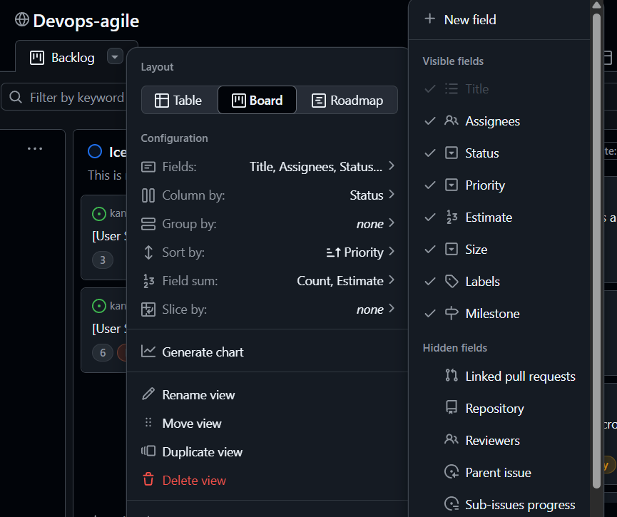
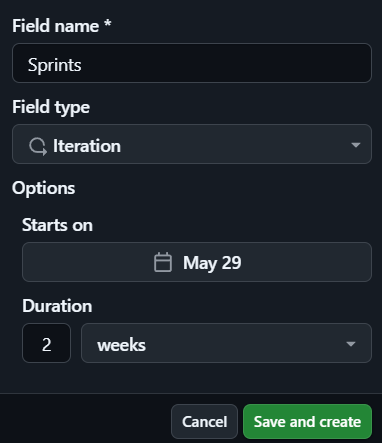
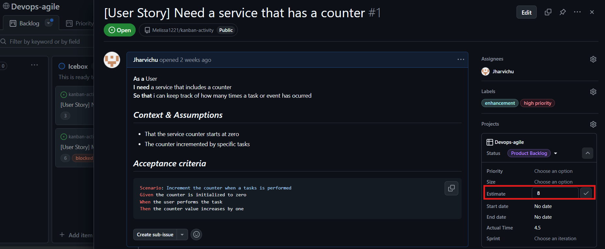
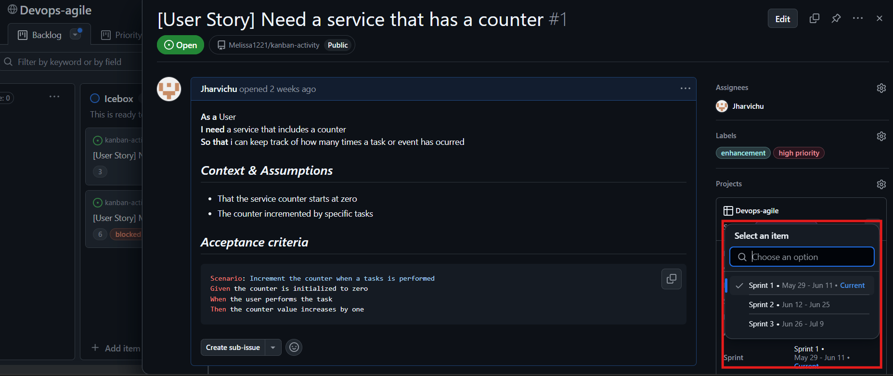
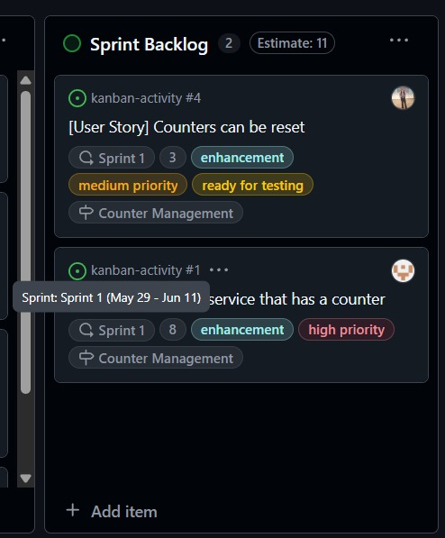
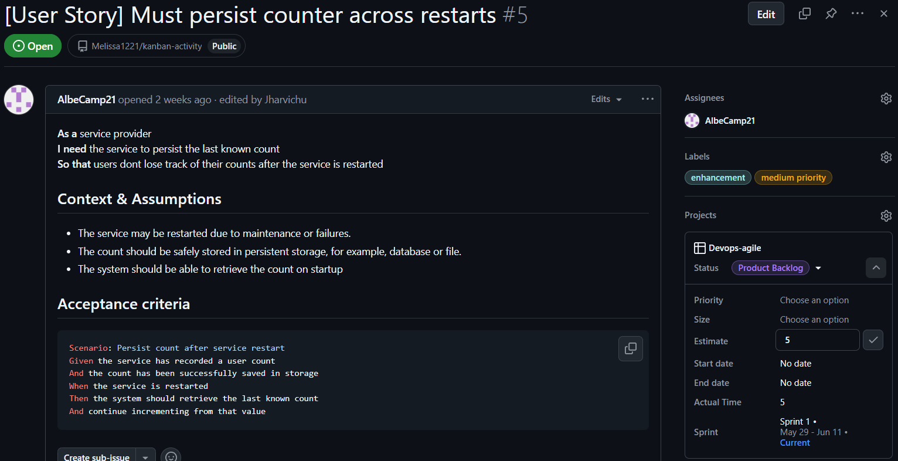
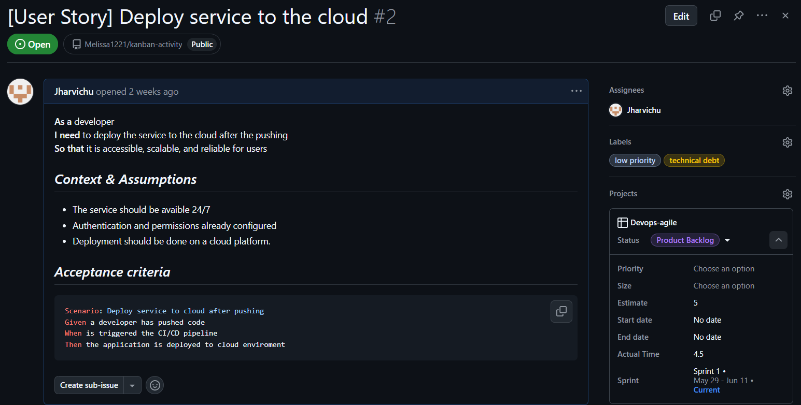
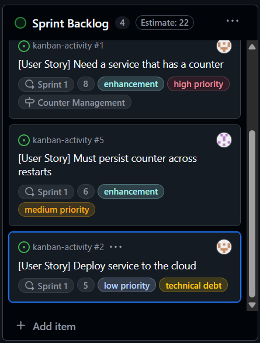
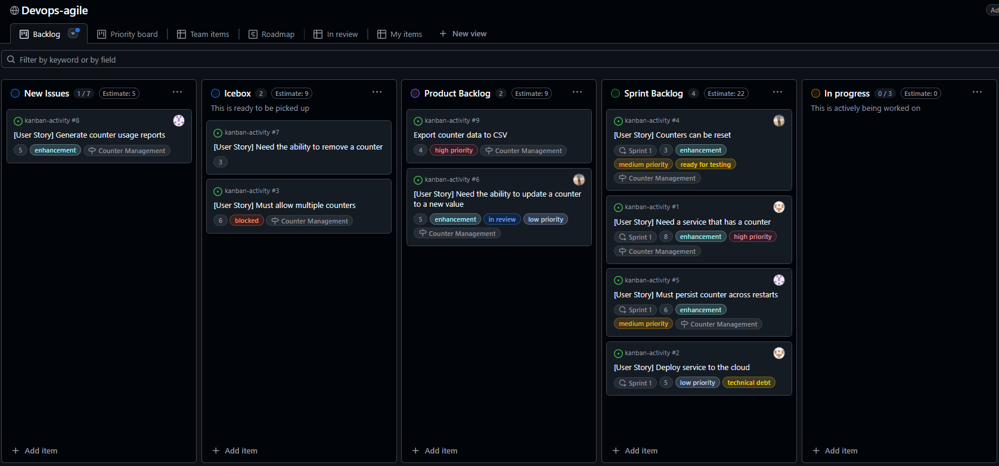

# Actividad 18: Gestión ágil de sprints con GitHub, planificación, ejecución y cierre de Sprints

### Parte 1:

En esta actividad simularemos una reunion sobre la planificación de sprints con el equipo. Asi que, primeramente, creamos un nuevo campo en el tablero kamban que hemos estado utilizando en la actividad 17.

Presionamos el despegable en el **Backlog**, daremos clic en **Field** y tambien en **New Field**

    

Llamamos al campo nuevo *Sprint* y cambiamos el tipo de campo a **Iteration**, el cual comienza el dia actual con una duracion de 2 semanas. 

    

En la reunion se acordo que la historia de usuario **Need a service that has a counter** es muy extensa y que vale 8 puntos de historia, asi que en **Estimate** le ponemos 8.

    

Ademas le colocamos esta historia en el primer sprint, como se muestra la imagen.

    

Al mover la targeta a la columna de Sprint Backlog, podemos ver la fecha de finalizacion al colocar el mouse encima del sprint, como se puede ver en la imagen:

    

Ademas en la reunión se hablo sobre las historias de usuario **Must persist counter across restars** Y **Deploy service to the cloud**, donde se estimo los puntos de historia y se determino que cabrian en el sprint actual.

    

    

Al estimar estas dos historias de Usuario, se mueve su targeta de la columna Product backlog a la columna Sprint backlog

    

Al terminar de hablar sobre la planificacion de sprints con el equipo, nos resultaria de la siguiente manera el kanban project:

    

### Parte 2